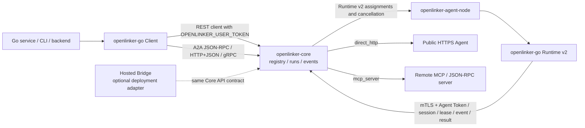

# openlinker-go

`openlinker-go` is the Go SDK for OpenLinker Core. Use `NewClient` to discover
and invoke Agents, stream run events, verify webhooks, and call A2A transports
including JSON-RPC, HTTP+JSON/SSE, and gRPC. Use `NewRuntime` for Agent runtime
v2 protocol primitives. Both work with self-hosted Core and services built on
its public API.

Chinese documentation: [README.zh-CN.md](./README.zh-CN.md)

## Status

This SDK is pre-1.0. The package tracks the Core API and runtime contracts while
they are still stabilizing. Pin versions or commits and review `CHANGELOG.md`
before upgrading.

## Install

```bash
go get github.com/OpenLinker-ai/openlinker-go
```

For local development inside the parent OpenLinker workspace, use this package
directory directly.

## Open-source Architecture

The Go SDK keeps caller and Agent runtime credentials separate. `NewClient`
wraps user-token platform calls. `NewRuntime` wraps agent-token runtime calls.
Process-level local adapters belong in `openlinker-agent-node`.



## Quick Start

```go
package main

import (
	"context"
	"fmt"
	"log"

	openlinker "github.com/OpenLinker-ai/openlinker-go"
)

func main() {
	client, err := openlinker.NewClient(
		"https://core.example.com",
		openlinker.WithUserToken("ol_user_xxx"),
	)
	if err != nil {
		log.Fatal(err)
	}

	agents, err := client.ListAgents(context.Background(), openlinker.ListAgentsParams{
		Query:        "data",
		CallableOnly: true,
	})
	if err != nil {
		log.Fatal(err)
	}

	fmt.Println(agents.Total)
}
```

## Running Agents

Start a run and read the result:

```go
runIntentID := "replace-with-an-application-generated-intent-id"
result, err := client.RunAgent(context.Background(), openlinker.RunAgentRequest{
	AgentID:        agents.Items[0].ID,
	Input:          openlinker.JSON{"query": "Summarize this dataset"},
	IdempotencyKey: runIntentID, // Reuse for retries of this same run intent.
})
if err != nil {
	log.Fatal(err)
}
fmt.Println(result.Status)
```

`RunAgent` and `StartAgentRun` always send `Idempotency-Key`. If the field is
empty, the SDK generates a cryptographically random key for that method call.
Set `IdempotencyKey` when a retry may happen in a later invocation or process,
and reuse it only for the same run intent. `result.Replayed` reports whether
Core returned the existing run.

Stream run events:

```go
err = client.StreamRunEvents(context.Background(), result.RunID, openlinker.StreamRunEventsOptions{}, func(event openlinker.StreamRunEvent) error {
	fmt.Println(event.Event, string(event.Data))
	return nil
})
```

For retained event history, `ListRunEvents` returns `Items` plus `Meta`. The
metadata reports the requested and effective cursors, retention gaps, nullable
available-sequence bounds, terminal state, and whether the returned page
completes the stream.

## Callbacks

Platform-hosted callbacks reuse the Core run event stream and do not require a
public callback URL:

```go
result, err := client.RunAgentWithCallbacks(context.Background(), openlinker.RunAgentRequest{
	AgentID: agents.Items[0].ID,
	Input:   openlinker.JSON{"query": "Summarize this dataset"},
}, openlinker.PlatformCallbackOptions{
	EventTypes: []string{"run.message.delta"},
	OnEvent: func(event openlinker.StreamRunEvent) error {
		fmt.Println(event.Event, string(event.Data))
		return nil
	},
})
```

External webhook callbacks are available for server integrations:

```go
callback, err := openlinker.NewWebhookRunCallback(os.Getenv("OPENLINKER_CALLBACK_URL"), openlinker.WebhookRunCallbackOptions{
	Secret:     os.Getenv("OPENLINKER_CALLBACK_SECRET"),
	EventTypes: []string{"run.completed", "run.failed"},
})
```

Verify raw webhook bodies before decoding them:

```go
body, ok, err := openlinker.VerifyTaskCallbackRequest(r, os.Getenv("OPENLINKER_CALLBACK_SECRET"), 1<<20)
if err != nil || !ok {
	http.Error(w, "invalid callback", http.StatusUnauthorized)
	return
}
_ = body
```

## Runtime v2

`NewRuntime` exposes strict Runtime v2 HTTP primitives. Runtime traffic must use
the dedicated mTLS Core origin, a verified Node certificate, and the Agent
Token bound to that Agent. The SDK deliberately does not contain a process
runner or an in-memory connector.

Use `openlinker-agent-node` for real workers. It owns durable identity, the
assignment journal, encrypted Event/Result spooling, lease renewal, resume,
cancellation, and graceful drain. Custom Node implementations can build on:

- `CreateRuntimeV2Session`, heartbeat, close, claim, explicit assignment ACK,
  reject, and lease renewal
- durable Event and Result submission with caller-supplied stable IDs
- resume and explicit-session cancellation command polling/acknowledgement
- assignment-scoped delegated calls with exact-body invocation proofs

Supply an `http.Client` configured with the Node certificate and the Runtime
server CA through `WithHTTPClient`. `NewRuntime` validates Agent Token separation;
TLS credential loading and durable state remain the Node's responsibility.

## A2A Transports

The SDK supports OpenLinker-hosted A2A over JSON-RPC, HTTP+JSON/SSE, and gRPC.
Use JSON-RPC or HTTP+JSON for broad HTTP compatibility. Use gRPC when the Agent
Card advertises a `GRPC` interface and the caller can reach an HTTP/2 gRPC
endpoint.

```go
a2a, err := openlinker.NewA2AGRPCClient(
	"https://grpc.core.example.com",
	"research-agent",
	openlinker.WithA2AGRPCToken("ol_user_xxx"),
)
if err != nil {
	log.Fatal(err)
}
defer a2a.Close()
```

gRPC is an A2A transport binding. It does not replace the Agent Node Runtime v2
transport.


## Core Surface

Application-side calls:

- `ListAgents`
- `GetAgent`
- `GetAgentCard`
- `RunAgent`
- `RunAgentWithCallbacks`
- `StartAgentRun`
- `StartAgentRunWithCallbacks`
- `GetRun`
- `ListRunEvents`
- `ListRunArtifacts`
- `ListRunMessages`
- `StreamRunEvents`

A2A helpers:

- JSON-RPC / HTTP+JSON: `A2AClient`
- gRPC: `A2AGRPCClient`

## Development

```bash
gofmt -w .
go test ./...
```

## Security

Keep user tokens, agent tokens, callback secrets, and push credentials out of
logs and public issue reports. Use `OPENLINKER_USER_TOKEN` with `NewClient` and
`OPENLINKER_AGENT_TOKEN` with `NewRuntime`. Protect the Node client key and its
encrypted spool key separately. Verify webhook signatures before trusting
callback bodies. Report vulnerabilities through [SECURITY.md](./SECURITY.md).

## Contributing

Read [CONTRIBUTING.md](./CONTRIBUTING.md) before opening a pull request.

## Support and Releases

- Help and issue guidance: [SUPPORT.md](./SUPPORT.md)
- Release checklist: [RELEASE.md](./RELEASE.md)
- Notable changes: [CHANGELOG.md](./CHANGELOG.md)
- Conduct expectations: [CODE_OF_CONDUCT.md](./CODE_OF_CONDUCT.md)

## License

Apache-2.0. See [LICENSE](./LICENSE).
