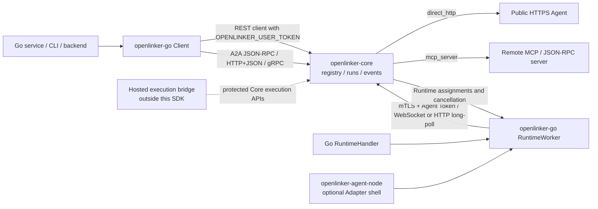

# openlinker-go

`openlinker-go` is the Go SDK for building and calling OpenLinker Agents. Most
Agent projects should start with the minimal facade below and let the SDK own
Runtime configuration, mTLS, durable state, lease, cancel, resume, reconnect,
transport switching, and graceful shutdown.

Chinese documentation: [README.zh-CN.md](./README.zh-CN.md)

## Minimal Agent Quick Start

```bash
go get github.com/OpenLinker-ai/openlinker-go@v0.2.0-rc.1
```

```go
package main

import (
	"context"
	"log"

	openlinker "github.com/OpenLinker-ai/openlinker-go"
)

type MyAgent struct{}

func (MyAgent) Run(ctx context.Context, input string) (string, error) {
	return "processed: " + input, nil
}

func main() {
	if err := openlinker.WithAgent(MyAgent{}).Run(context.Background()); err != nil {
		log.Fatal(err)
	}
}
```

The function form is `openlinker.WithFunc(fn).Run(ctx)`. See the runnable
[minimal Agent demo](./example/runtime/agent-generic), then use the
[example index](./example/README.md) to find one focused example per concept.

## Choose the API Mode

1. **Minimal Agent** — `WithAgent` / `WithFunc`; recommended for ordinary Go Agents.
2. **Explicit registration and run** — attach `RunOrRegister` or `WithRegistration`; registration never happens merely because a User Token exists.
3. **Native Runtime** — `Native(handler)` for metadata, events, progress, delegation, deadlines, and custom results; the SDK still owns the worker lifecycle.
4. **Managed Worker / protocol** — `NewRuntimeWorker` for advanced embedding; `NewRuntime` only for infrastructure that intentionally owns journal, lease, spool, resume, cancel, reconnect, and transport switching.

Recommended examples: [registration](./example/runtime/agent-register),
[Native events](./example/runtime/native-events),
[Managed RuntimeWorker](./example/runtime/worker-managed), and
[low-level protocol](./example/runtime/protocol-http).

## Transport Is Independent

API mode and network transport are separate choices. Minimal Agent, explicit
registration, and Native Runtime all support:

- `TransportAuto` (default): prefer WebSocket, use HTTP long-poll only for transport availability, and safely probe WebSocket recovery.
- `TransportWebSocket`: strict WebSocket only.
- `TransportHTTP`: strict HTTP long-poll only.

Authentication, mTLS, permission, payload, and contract errors never trigger
fallback. See [Runtime API modes](./docs/runtime-api-modes.md) for the full layering.

## Status

This SDK is pre-1.0. The package tracks the Core API and runtime contracts while
they are still stabilizing. Pin versions or commits and review `CHANGELOG.md`
before upgrading.

The SDK wraps the public Core contract in self-hosted and Hosted deployments.
Hosted authentication, service listings, orders, wallets, billing, and
marketplace-operation APIs are intentionally outside this package.

## Install

```bash
go get github.com/OpenLinker-ai/openlinker-go@v0.x.y
```

Replace `v0.x.y` with a release you have pinned.

For local development inside the parent OpenLinker workspace, use this package
directory directly.

## Open-source Architecture

The Go SDK keeps caller and Runtime credentials separate. `NewClient` wraps
User Token platform calls. `NewRuntimeWorker` discovers the dedicated mTLS
Runtime origin and owns delivery, recovery, and durable state. Process-level
HTTP, command, Codex, and A2A adapters belong in `openlinker-agent-node`.
The `mcp_server` value describes how Core reaches an Agent; this SDK does not
currently expose a separate MCP protocol client.



## Client Quick Start

```go
package main

import (
	"context"
	"fmt"
	"log"

	openlinker "github.com/OpenLinker-ai/openlinker-go"
)

func main() {
	client, err := openlinker.NewClient(
		"https://core.example.com",
		openlinker.WithUserToken("ol_user_xxx"),
	)
	if err != nil {
		log.Fatal(err)
	}

	agents, err := client.ListAgents(context.Background(), openlinker.ListAgentsParams{
		Query:        "data",
		CallableOnly: true,
	})
	if err != nil {
		log.Fatal(err)
	}

	fmt.Println(agents.Total)
}
```

## Running Agents

Start a run and read the result:

```go
runIntentID := "replace-with-an-application-generated-intent-id"
result, err := client.RunAgent(context.Background(), openlinker.RunAgentRequest{
	AgentID:        agents.Items[0].ID,
	Input:          openlinker.JSON{"query": "Summarize this dataset"},
	IdempotencyKey: runIntentID, // Reuse for retries of this same run intent.
})
if err != nil {
	log.Fatal(err)
}
fmt.Println(result.Status)
```

`RunAgent` and `StartAgentRun` always send `Idempotency-Key`. If the field is
empty, the SDK generates a cryptographically random key for that method call.
Set `IdempotencyKey` when a retry may happen in a later invocation or process,
and reuse it only for the same run intent. `result.Replayed` reports whether
Core returned the existing run.

Stream run events:

```go
err = client.StreamRunEvents(context.Background(), result.RunID, openlinker.StreamRunEventsOptions{}, func(event openlinker.StreamRunEvent) error {
	fmt.Println(event.Event, string(event.Data))
	return nil
})
```

For retained event history, `ListRunEvents` returns `Items` plus `Meta`. The
metadata reports the requested and effective cursors, retention gaps, nullable
available-sequence bounds, terminal state, and whether the returned page
completes the stream.

## Callbacks

Platform-hosted callbacks reuse the Core run event stream and do not require a
public callback URL:

```go
result, err := client.RunAgentWithCallbacks(context.Background(), openlinker.RunAgentRequest{
	AgentID: agents.Items[0].ID,
	Input:   openlinker.JSON{"query": "Summarize this dataset"},
}, openlinker.PlatformCallbackOptions{
	EventTypes: []string{"run.message.delta"},
	OnEvent: func(event openlinker.StreamRunEvent) error {
		fmt.Println(event.Event, string(event.Data))
		return nil
	},
})
```

External webhook callbacks are available for server integrations:

```go
callback, err := openlinker.NewWebhookRunCallback(os.Getenv("OPENLINKER_CALLBACK_URL"), openlinker.WebhookRunCallbackOptions{
	Secret:     os.Getenv("OPENLINKER_CALLBACK_SECRET"),
	EventTypes: []string{"run.completed", "run.failed"},
})
```

Verify raw webhook bodies before decoding them:

```go
body, ok, err := openlinker.VerifyTaskCallbackRequest(r, os.Getenv("OPENLINKER_CALLBACK_SECRET"), 1<<20)
if err != nil || !ok {
	http.Error(w, "invalid callback", http.StatusUnauthorized)
	return
}
_ = body
```

## OpenLinker Runtime

Before the first deployment, follow the Chinese
[end-to-end RuntimeWorker runbook](./docs/runtime-worker-end-to-end.zh-CN.md) to prepare the
Agent identity, Runtime Node, mTLS and durable storage, then verify a real Run, cancellation and
process restart. Runtime Ready proves connectivity only; it does not prove end-to-end callability.

Most Go Agents should start with the minimal facade. It loads the standard
environment, opens the encrypted Runtime store, and runs the canonical worker:

```go
type MyAgent struct{}

func (MyAgent) Run(ctx context.Context, input string) (string, error) {
	return "processed: " + input, nil
}

if err := openlinker.WithAgent(MyAgent{}).Run(context.Background()); err != nil {
	log.Fatal(err)
}
```

Registration is explicit through `RunOrRegister` or `WithRegistration`; merely
setting a User Token never creates platform resources. Frameworks that need
assignment identity, metadata, custom events, progress, deadlines, or delegated
calls use `Native(handler)`. Infrastructure code can construct `RuntimeWorker`
directly or use the lower-level `NewRuntime` protocol client.

`RuntimeWorker` owns discovery, mTLS, Session lifecycle, WebSocket-to-pull
recovery, assignment confirmation, lease renewal, resume, cancellation, drain,
and the encrypted assignment/Event/Result store. A handler runs only after Core
confirms the assignment.

```go
worker, err := openlinker.NewRuntimeWorker(openlinker.RuntimeWorkerConfig{
	PlatformURL: "https://openlinker.example",
	NodeID:      os.Getenv("OPENLINKER_NODE_ID"),
	AgentID:     os.Getenv("OPENLINKER_AGENT_ID"),
	AgentToken:  os.Getenv("OPENLINKER_AGENT_TOKEN"),
	Transport:   openlinker.RuntimeTransportAuto,
	DataDir:     "/var/lib/my-agent/runtime",
	MTLS: openlinker.RuntimeMTLSConfig{
		CertFile: "/run/openlinker/node.crt",
		KeyFile:  "/run/openlinker/node.key",
		CAFile:   "/run/openlinker/core-ca.crt",
	},
	Handler: openlinker.RuntimeHandlerFunc(func(ctx context.Context, run openlinker.RuntimeContext) (openlinker.RuntimeResult, error) {
		if err := run.Emit("run.message.delta", map[string]any{"text": "working"}); err != nil {
			return openlinker.RuntimeResult{}, err
		}
		return openlinker.RuntimeResult{Output: map[string]any{"answer": 42}}, nil
	}),
})
if err != nil {
	log.Fatal(err)
}
if err := worker.Start(context.Background()); err != nil {
	log.Fatal(err)
}
```

Production workers should use the default `FileRuntimeStore` through `DataDir`,
or inject another durable `RuntimeStore`. An in-memory store is suitable only
for explicit tests. `NodeVersion` defaults to `openlinker-go/runtime-worker` and
can be set when the host binary has its own enrolled version.

The canonical WebSocket endpoint is `/api/v1/agent-runtime/ws`; HTTP methods
use the `/api/v1/agent-runtime/` prefix. Protocol negotiation remains in the
handshake contract, not in public API names or URLs.

`NewRuntime` exposes the strict HTTP and WebSocket protocol client beneath the
worker. Applications that need those primitives can build on:

- `DialRuntimeWebSocket`, typed assignment/command channels, correlated ACKs,
  lease renewal, Event/Result submission, resume, and cancellation ACK
- HTTP `CreateRuntimeSession`, heartbeat, close, long-poll claim, explicit
  assignment ACK/reject, command poll, and lease renewal
- durable Event and Result submission with caller-supplied stable IDs
- resume and explicit-session cancellation command polling/acknowledgement
- assignment-scoped delegated calls with exact-body invocation proofs

`openlinker-agent-node` is an optional Adapter shell. It injects an HTTP,
command, Codex, or A2A handler into this SDK worker; it does not own a second
Runtime state machine.

API layering and registration details are documented in
[Runtime API modes](./docs/runtime-api-modes.md) and
[Native Runtime registration (Chinese)](./docs/runtime-native-registration.zh-CN.md).
The downstream layout migration is documented in
[openlinker-agent-layout migration (Chinese)](./docs/openlinker-agent-layout-migration.zh-CN.md).

## A2A Transports

The SDK supports OpenLinker-hosted A2A over JSON-RPC, HTTP+JSON/SSE, and gRPC.
Use JSON-RPC or HTTP+JSON for broad HTTP compatibility. Use gRPC when the Agent
Card advertises a `GRPC` interface and the caller can reach an HTTP/2 gRPC
endpoint.

```go
a2a, err := openlinker.NewA2AGRPCClient(
	"https://grpc.core.example.com",
	"research-agent",
	openlinker.WithA2AGRPCToken("ol_user_xxx"),
)
if err != nil {
	log.Fatal(err)
}
defer a2a.Close()
```

gRPC is an A2A transport binding. It does not replace OpenLinker Runtime.


## Core Surface

Application-side calls:

- `ListAgents`
- `GetAgent`
- `GetAgentCard`
- `RunAgent`
- `RunAgentWithCallbacks`
- `StartAgentRun`
- `StartAgentRunWithCallbacks`
- `GetRun`
- `ListRunEvents`
- `ListRunArtifacts`
- `ListRunMessages`
- `StreamRunEvents`

A2A helpers:

- JSON-RPC / HTTP+JSON: `A2AClient`
- gRPC: `A2AGRPCClient`

## Development

```bash
gofmt -w .
go test ./...
```

## Security

Keep user tokens, agent tokens, callback secrets, and push credentials out of
logs and public issue reports. Use `OPENLINKER_USER_TOKEN` with `NewClient` and
`OPENLINKER_AGENT_TOKEN` with `NewRuntimeWorker`. Protect the Runtime client key
and its encrypted spool key separately. Verify webhook signatures before trusting
callback bodies. Report vulnerabilities through [SECURITY.md](./SECURITY.md).

## Contributing

Read [CONTRIBUTING.md](./CONTRIBUTING.md) before opening a pull request.

## Support and Releases

- Help and issue guidance: [SUPPORT.md](./SUPPORT.md)
- Release checklist: [RELEASE.md](./RELEASE.md)
- Notable changes: [CHANGELOG.md](./CHANGELOG.md)
- Conduct expectations: [CODE_OF_CONDUCT.md](./CODE_OF_CONDUCT.md)

## License

Apache-2.0. See [LICENSE](./LICENSE).
