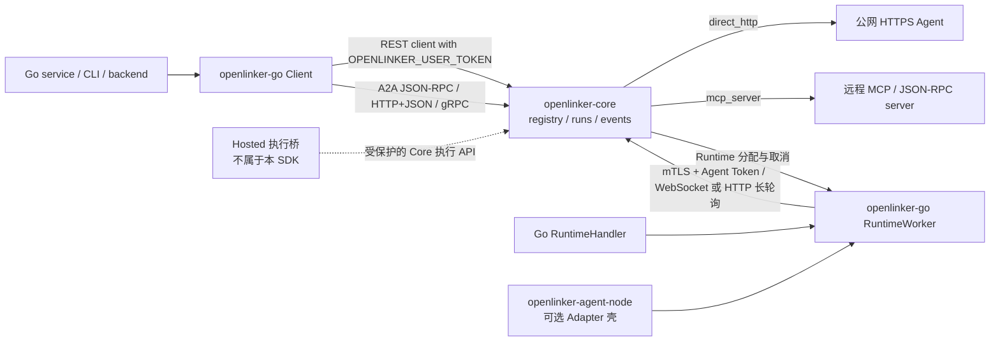

# openlinker-go

`openlinker-go` 是用于开发和调用 OpenLinker Agent 的 Go SDK。绝大多数 Agent 项目应从
下面的极简入口开始，由 SDK 统一管理 Runtime 配置、mTLS、持久化状态、lease、cancel、
resume、重连、传输切换和优雅关闭。

English documentation: [README.md](./README.md)

## 极简 Agent 快速开始

```bash
go get github.com/OpenLinker-ai/openlinker-go@v0.2.0-rc.1
```

```go
package main

import (
	"context"
	"log"

	openlinker "github.com/OpenLinker-ai/openlinker-go"
)

type MyAgent struct{}

func (MyAgent) Run(ctx context.Context, input string) (string, error) {
	return "处理结果：" + input, nil
}

func main() {
	if err := openlinker.WithAgent(MyAgent{}).Run(context.Background()); err != nil {
		log.Fatal(err)
	}
}
```

函数形式是 `openlinker.WithFunc(fn).Run(ctx)`。建议先运行
[极简 Agent 示例](./example/runtime/agent-generic)，再通过
[完整示例索引](./example/README.md) 查找单概念 demo。

## 选择 API 模式

1. **极简 Agent**：`WithAgent` / `WithFunc`，推荐普通 Go Agent 使用。
2. **显式注册并运行**：附加 `RunOrRegister` 或 `WithRegistration`；仅检测到 User Token 绝不会自动创建平台资源。
3. **Native Runtime**：需要 metadata、事件、进度、委派、deadline 或自定义结果时使用 `Native(handler)`；Worker 生命周期仍由 SDK 管理。
4. **Managed Worker / 底层协议**：高级嵌入使用 `NewRuntimeWorker`；只有明确愿意自行负责 journal、lease、spool、resume、cancel、重连和传输切换的基础设施才使用 `NewRuntime`。

推荐示例：[显式注册](./example/runtime/agent-register)、
[Native 事件](./example/runtime/native-events)、
[Managed RuntimeWorker](./example/runtime/worker-managed) 和
[底层协议](./example/runtime/protocol-http)。

## 传输模式与 API 模式互相独立

极简 Agent、显式注册和 Native Runtime 都可以选择：

- `TransportAuto`（默认）：优先 WebSocket，仅因传输不可用切换到 HTTP long-poll，并安全探测 WebSocket 恢复。
- `TransportWebSocket`：只使用 WebSocket。
- `TransportHTTP`：只使用 HTTP long-poll。

认证、mTLS、权限、payload 和 contract 错误不会触发 fallback。完整分层见
[Runtime API 模式](./docs/runtime-api-modes.zh-CN.md)。

## 状态

本 SDK 目前是 pre-1.0。它跟随 Core API 和 runtime 契约演进。升级前请固定版本或
commit，并阅读 [CHANGELOG.md](./CHANGELOG.md)。

本 SDK 不包含钱包、扣费、Stripe、提现、商业 Dashboard 或具体本地 adapter 实现。
默认 client 使用 `OPENLINKER_USER_TOKEN`，runtime 使用 `OPENLINKER_AGENT_TOKEN`。

SDK 在自托管和 Hosted 部署中都只封装 Core 公共契约。Hosted 认证、服务商品、订单、
钱包、计费和市场运营 API 不进入本包。

## 开源架构图

Go SDK 把调用方凭证和 Runtime 凭证分开。`NewClient` 封装 User Token 平台调用；
`NewRuntimeWorker` 发现专用 mTLS Runtime 地址，并负责交付、恢复和持久化。HTTP、command、
Codex、A2A 等进程级 adapter 属于 `openlinker-agent-node`。
`mcp_server` 只描述 Core 如何找到 Agent；本 SDK 当前没有单独的 MCP 协议 client。



## 安装

```bash
go get github.com/OpenLinker-ai/openlinker-go@v0.x.y
```

请把 `v0.x.y` 替换成已经固定的 release。

父 OpenLinker workspace 内本地开发时，可以直接使用此目录。

## Client 快速开始

```go
package main

import (
	"context"
	"fmt"
	"log"

	openlinker "github.com/OpenLinker-ai/openlinker-go"
)

func main() {
	client, err := openlinker.NewClient(
		"https://core.example.com",
		openlinker.WithUserToken("ol_user_xxx"),
	)
	if err != nil {
		log.Fatal(err)
	}

	agents, err := client.ListAgents(context.Background(), openlinker.ListAgentsParams{
		Query:        "data",
		CallableOnly: true,
	})
	if err != nil {
		log.Fatal(err)
	}

	fmt.Println(agents.Total)
}
```

`NewClient` 会拒绝 Agent Token；Agent Runtime 场景请使用 `NewRuntimeWorker`。

## 运行 Agent

启动 run 并读取结果：

```go
runIntentID := "replace-with-an-application-generated-intent-id"
result, err := client.RunAgent(context.Background(), openlinker.RunAgentRequest{
	AgentID:        agents.Items[0].ID,
	Input:          openlinker.JSON{"query": "Summarize this dataset"},
	IdempotencyKey: runIntentID, // 同一次运行意图重试时复用。
})
```

`RunAgent` 和 `StartAgentRun` 始终发送 `Idempotency-Key`。字段为空时，SDK
会为本次方法调用生成密码学随机 key；如果重试可能跨方法调用或进程，请显式设置
`IdempotencyKey`，并且只在同一运行意图中复用。`result.Replayed` 表示 Core
返回的是已经存在的 Run。

监听 run 事件：

```go
err = client.StreamRunEvents(context.Background(), result.RunID, openlinker.StreamRunEventsOptions{}, func(event openlinker.StreamRunEvent) error {
	fmt.Println(event.Event, string(event.Data))
	return nil
})
```

读取已保留的事件历史时，`ListRunEvents` 返回 `Items` 和 `Meta`。元数据会明确给出
请求游标、实际游标、保留缺口、可为空的可用序号边界、终态，以及本页是否已经覆盖
完整事件流。

## Callback

平台托管 callback 复用 Core run event stream，不需要公网 callback URL：

```go
result, err := client.RunAgentWithCallbacks(context.Background(), openlinker.RunAgentRequest{
	AgentID: agents.Items[0].ID,
	Input:   openlinker.JSON{"query": "Summarize this dataset"},
}, openlinker.PlatformCallbackOptions{
	EventTypes: []string{"run.message.delta"},
	OnEvent: func(event openlinker.StreamRunEvent) error {
		fmt.Println(event.Event, string(event.Data))
		return nil
	},
})
```

外部 webhook callback 适合服务端集成：

```go
callback, err := openlinker.NewWebhookRunCallback(os.Getenv("OPENLINKER_CALLBACK_URL"), openlinker.WebhookRunCallbackOptions{
	Secret:     os.Getenv("OPENLINKER_CALLBACK_SECRET"),
	EventTypes: []string{"run.completed", "run.failed"},
})
```

处理 webhook 时必须先校验原始请求体签名，再解析 payload：

```go
body, ok, err := openlinker.VerifyTaskCallbackRequest(r, os.Getenv("OPENLINKER_CALLBACK_SECRET"), 1<<20)
if err != nil || !ok {
	http.Error(w, "invalid callback", http.StatusUnauthorized)
	return
}
_ = body
```

## OpenLinker Runtime

第一次部署前，请先按
[《从零运行一个 RuntimeWorker：完整操作手册》](./docs/runtime-worker-end-to-end.zh-CN.md)
准备 Agent 身份、Runtime Node、mTLS、持久化目录，并完成真实 Run、cancel 和重启验收。
`Runtime Ready` 只代表连接成功，不代表 Agent 已经完整可调用。

绝大多数 Go Agent 应从极简 facade 开始。SDK 会读取标准环境变量、打开加密 Runtime Store，
并运行同一套可靠 Worker：

```go
type MyAgent struct{}

func (MyAgent) Run(ctx context.Context, input string) (string, error) {
	return "处理结果：" + input, nil
}

if err := openlinker.WithAgent(MyAgent{}).Run(context.Background()); err != nil {
	log.Fatal(err)
}
```

自动注册必须通过 `RunOrRegister` 或 `WithRegistration` 显式开启；仅设置 User Token 不会创建
平台资源。需要 Assignment identity、Metadata、自定义事件、进度、deadline 或 Agent 委派的
框架使用 `Native(handler)`。基础设施实现可以直接构造 `RuntimeWorker`，或只使用底层
`NewRuntime` 协议 API。

`RuntimeWorker` 负责地址发现、mTLS、Session、WebSocket/Pull 自动切换、assignment 确认、
续租、resume、取消、drain，以及 assignment/Event/Result 的加密持久化。只有 Core 明确
确认 assignment 后才会调用 handler。

```go
worker, err := openlinker.NewRuntimeWorker(openlinker.RuntimeWorkerConfig{
	PlatformURL: "https://openlinker.example",
	NodeID:      os.Getenv("OPENLINKER_NODE_ID"),
	AgentID:     os.Getenv("OPENLINKER_AGENT_ID"),
	AgentToken:  os.Getenv("OPENLINKER_AGENT_TOKEN"),
	Transport:   openlinker.RuntimeTransportAuto,
	DataDir:     "/var/lib/my-agent/runtime",
	MTLS: openlinker.RuntimeMTLSConfig{
		CertFile: "/run/openlinker/node.crt",
		KeyFile:  "/run/openlinker/node.key",
		CAFile:   "/run/openlinker/core-ca.crt",
	},
	Handler: openlinker.RuntimeHandlerFunc(func(ctx context.Context, run openlinker.RuntimeContext) (openlinker.RuntimeResult, error) {
		if err := run.Emit("run.message.delta", map[string]any{"text": "working"}); err != nil {
			return openlinker.RuntimeResult{}, err
		}
		return openlinker.RuntimeResult{Output: map[string]any{"answer": 42}}, nil
	}),
})
if err != nil {
	log.Fatal(err)
}
if err := worker.Start(context.Background()); err != nil {
	log.Fatal(err)
}
```

生产环境应通过 `DataDir` 使用默认 `FileRuntimeStore`，也可以注入其他持久化
`RuntimeStore`。内存实现只适合明确的测试。`NodeVersion` 默认是
`openlinker-go/runtime-worker`；宿主程序有独立登记版本时应显式设置。

WebSocket 的标准端点是 `/api/v1/agent-runtime/ws`，HTTP 方法统一使用
`/api/v1/agent-runtime/` 前缀。协议协商保留在握手 contract 内，不进入公开 API 名或 URL。

`NewRuntime` 继续提供 HTTP/WebSocket 协议原语。`openlinker-agent-node` 只是可选 Adapter
壳，把 HTTP、command、Codex 或 A2A handler 注入本 SDK，不再维护第二套 Runtime 状态机。

需要底层能力的应用可以使用：

- `DialRuntimeWebSocket`、类型化 assignment/command channel、关联 ACK、续租、Event/Result 提交、resume 和取消 ACK；
- HTTP Session create、heartbeat、close、长轮询 claim、assignment ACK/reject、command poll 和续租；
- 使用调用方稳定 ID 的 Event / Result 可靠提交；
- resume、显式 Session 的取消命令 polling / acknowledgement；
- 带精确请求体 invocation proof 的 assignment-scoped Agent 子调用。

API 分层见 [docs/runtime-api-modes.zh-CN.md](./docs/runtime-api-modes.zh-CN.md)，Native 与显式注册见
[docs/runtime-native-registration.zh-CN.md](./docs/runtime-native-registration.zh-CN.md)，
RuntimeWorker 端到端部署见
[docs/runtime-worker-end-to-end.zh-CN.md](./docs/runtime-worker-end-to-end.zh-CN.md)，
layout 迁移见
[docs/openlinker-agent-layout-migration.zh-CN.md](./docs/openlinker-agent-layout-migration.zh-CN.md)，
远端冲突合并记录见
[docs/runtime-remote-reconcile-plan.md](./docs/runtime-remote-reconcile-plan.md)。

## A2A Transport

SDK 支持 OpenLinker 托管的 A2A JSON-RPC、HTTP+JSON/SSE 和 gRPC。普通 HTTP 兼容场景
优先使用 JSON-RPC 或 HTTP+JSON；当 Agent Card 声明 `GRPC` 接口且调用方可以访问 HTTP/2
gRPC endpoint 时使用 gRPC。

```go
a2a, err := openlinker.NewA2AGRPCClient(
	"https://grpc.core.example.com",
	"research-agent",
	openlinker.WithA2AGRPCToken("ol_user_xxx"),
)
if err != nil {
	log.Fatal(err)
}
defer a2a.Close()
```

gRPC 是 A2A transport binding，不替代 OpenLinker Runtime。

## Core Surface

应用侧调用：

- `ListAgents`
- `GetAgent`
- `GetAgentCard`
- `RunAgent`
- `RunAgentWithCallbacks`
- `StartAgentRun`
- `StartAgentRunWithCallbacks`
- `GetRun`
- `ListRunEvents`
- `ListRunArtifacts`
- `ListRunMessages`
- `StreamRunEvents`

A2A helper：

- JSON-RPC / HTTP+JSON：`A2AClient`
- gRPC：`A2AGRPCClient`

## 开发

```bash
gofmt -w .
go test ./...
```

## 安全

不要把 user token、agent token、callback secret 或 push credential 写入日志或公开 Issue。
`OPENLINKER_USER_TOKEN` 用于 `NewClient`，`OPENLINKER_AGENT_TOKEN` 用于 `NewRuntimeWorker`；
Runtime 客户端私钥与加密 spool key 必须分开保护。信任 webhook payload 前必须校验签名。
漏洞请通过 [SECURITY.zh-CN.md](./SECURITY.zh-CN.md) 报告。

## 贡献

提交 PR 前请阅读 [CONTRIBUTING.zh-CN.md](./CONTRIBUTING.zh-CN.md)。SDK 只封装开源 Core
协议，不加入 Cloud 钱包、商业计费或托管市场内部接口。公共 API 变化要同步测试和契约文件。

## 支持和发布

- 支持说明：[SUPPORT.zh-CN.md](./SUPPORT.zh-CN.md)
- 发布清单：[RELEASE.zh-CN.md](./RELEASE.zh-CN.md)
- 英文变更记录：[CHANGELOG.md](./CHANGELOG.md)
- 行为准则：[CODE_OF_CONDUCT.md](./CODE_OF_CONDUCT.md)

## 许可证

Apache-2.0。详见 [LICENSE](./LICENSE)。
