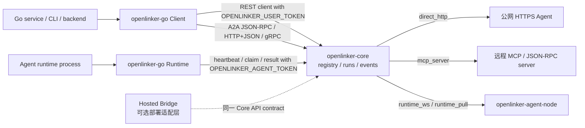

# openlinker-go

`openlinker-go` 是 OpenLinker Core 的 Go SDK。Go 服务使用 `NewClient` 查找和调用 Agent、
监听运行事件、验证 Webhook，并调用 A2A JSON-RPC、HTTP+JSON/SSE 和 gRPC；Agent
runtime connector 使用 `NewRuntime`。两者都适用于自托管 Core 和基于其公开 API
构建的服务。

English documentation: [README.md](./README.md)

## 状态

本 SDK 目前是 pre-1.0。它跟随 Core API 和 runtime 契约演进。升级前请固定版本或
commit，并阅读 [CHANGELOG.md](./CHANGELOG.md)。

本 SDK 不包含钱包、扣费、Stripe、提现、商业 Dashboard 或具体本地 adapter 实现。
默认 client 使用 `OPENLINKER_USER_TOKEN`，runtime 使用 `OPENLINKER_AGENT_TOKEN`。
## 开源架构图

Go SDK 把调用方凭证和 Agent runtime 凭证分开。`NewClient` 封装 user-token 平台调用；
`NewRuntime` 封装 agent-token runtime 调用。进程级本地 adapter 属于
`openlinker-agent-node`。



## 安装

```bash
go get github.com/OpenLinker-ai/openlinker-go
```

父 OpenLinker workspace 内本地开发时，可以直接使用此目录。

## 快速开始

```go
package main

import (
	"context"
	"fmt"
	"log"

	openlinker "github.com/OpenLinker-ai/openlinker-go"
)

func main() {
	client, err := openlinker.NewClient(
		"https://core.example.com",
		openlinker.WithUserToken("ol_user_xxx"),
	)
	if err != nil {
		log.Fatal(err)
	}

	agents, err := client.ListAgents(context.Background(), openlinker.ListAgentsParams{
		Query:        "data",
		CallableOnly: true,
	})
	if err != nil {
		log.Fatal(err)
	}

	fmt.Println(agents.Total)
}
```

`NewClient` 会拒绝 agent token；Agent runtime 场景请使用 `NewRuntime`。

## 运行 Agent

启动 run 并读取结果：

```go
runIntentID := "replace-with-an-application-generated-intent-id"
result, err := client.RunAgent(context.Background(), openlinker.RunAgentRequest{
	AgentID:        agents.Items[0].ID,
	Input:          openlinker.JSON{"query": "Summarize this dataset"},
	IdempotencyKey: runIntentID, // 同一次运行意图重试时复用。
})
```

`RunAgent` 和 `StartAgentRun` 始终发送 `Idempotency-Key`。字段为空时，SDK
会为本次方法调用生成密码学随机 key；如果重试可能跨方法调用或进程，请显式设置
`IdempotencyKey`，并且只在同一运行意图中复用。`result.Replayed` 表示 Core
返回的是已经存在的 Run。

监听 run 事件：

```go
err = client.StreamRunEvents(context.Background(), result.RunID, func(event openlinker.StreamRunEvent) error {
	fmt.Println(event.Event, string(event.Data))
	return nil
})
```

读取已保留的事件历史时，`ListRunEvents` 返回 `Items` 和 `Meta`。元数据会明确给出
请求游标、实际游标、保留缺口、可为空的可用序号边界、终态，以及本页是否已经覆盖
完整事件流。

## Callback

平台托管 callback 复用 Core run event stream，不需要公网 callback URL。外部 webhook
callback 适合服务端集成。处理 webhook 时必须先校验原始请求体签名，再解析 payload。

## Runtime Connector

Agent runtime 进程通过 `NewRuntime` 使用 `OPENLINKER_AGENT_TOKEN`：

```go
runtime, err := openlinker.NewRuntime(
	"https://core.example.com",
	openlinker.WithAgentToken(os.Getenv("OPENLINKER_AGENT_TOKEN")),
)
if err != nil {
	log.Fatal(err)
}

connector := openlinker.NewRuntimePullConnector(runtime)
```

SDK 在 `Runtime` 上包含基础 Agent runtime 集成层：

- `HeartbeatAgent`
- `ClaimRuntimeRun`
- `ClaimRuntimeRunDetailed`
- `CompleteRuntimeRun`
- `CallAgent`
- `CallAgentAt`
- `RuntimePullConnector`
- `RuntimeWSConnector`
- `Native`

原生 Go worker 可以用 `WithAgent` 管理连接生命周期和默认结果映射；如果需要自己处理
分配消息与结果映射，则使用 `Native`。两者默认读取：

- `OPENLINKER_API_BASE`
- `OPENLINKER_AGENT_TOKEN`
- `OPENLINKER_WORKER_CONNECTOR`
- `OPENLINKER_WORKER_PULL_WAIT`
- `OPENLINKER_WORKER_MAX_RUNS`

旧部署仍可暂时使用 `OPENLINKER_RUNTIME_TOKEN`，新配置应统一使用
`OPENLINKER_AGENT_TOKEN` 和 `ol_agent_` 开头的 Agent Token。

本包不包含 command、Codex、OpenClaw 或本地 HTTP 后端 adapter。进程级集成请使用
`openlinker-agent-node`。

## A2A Transport

SDK 支持 OpenLinker 托管的 A2A JSON-RPC、HTTP+JSON/SSE 和 gRPC。普通 HTTP 兼容场景
优先使用 JSON-RPC 或 HTTP+JSON；当 Agent Card 声明 `GRPC` 接口且调用方可以访问 HTTP/2
gRPC endpoint 时使用 gRPC。

gRPC 是 A2A transport binding，不替代 Agent Node 内部 `runtime_ws` / `runtime_pull`。

## 开发

```bash
gofmt -w .
go test ./...
```

## 安全

不要把 user token、agent token、callback secret 或 push credential 写入日志或公开 Issue。
`OPENLINKER_USER_TOKEN` 用于 `NewClient`，`OPENLINKER_AGENT_TOKEN` 用于 `NewRuntime`。
信任 webhook payload 前必须校验签名。漏洞请通过 [SECURITY.zh-CN.md](./SECURITY.zh-CN.md)
报告。

## 贡献

提交 PR 前请阅读 [CONTRIBUTING.zh-CN.md](./CONTRIBUTING.zh-CN.md)。SDK 只封装开源 Core
协议，不加入 Cloud 钱包、商业计费或托管市场内部接口。公共 API 变化要同步测试和契约文件。

## 支持和发布

- 支持说明：[SUPPORT.zh-CN.md](./SUPPORT.zh-CN.md)
- 发布清单：[RELEASE.zh-CN.md](./RELEASE.zh-CN.md)
- 英文变更记录：[CHANGELOG.md](./CHANGELOG.md)
- 行为准则：[CODE_OF_CONDUCT.md](./CODE_OF_CONDUCT.md)

## 许可证

Apache-2.0。详见 [LICENSE](./LICENSE)。
